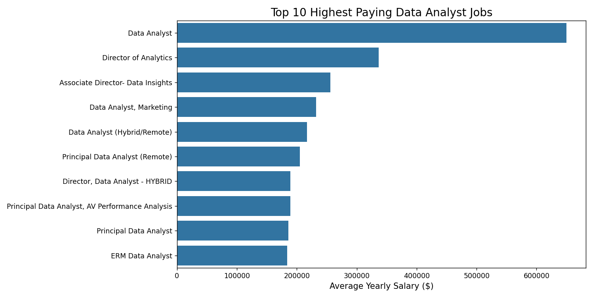
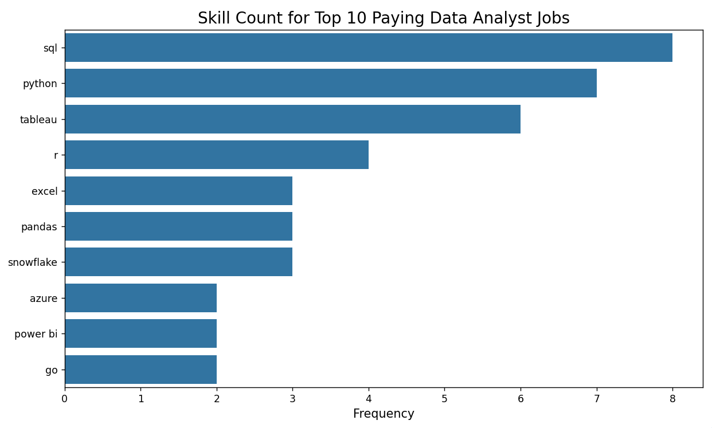

# Introduction
Explore the data job market! This project looks at Data Analyst roles to find:

The highest-paying jobs.

The most popular skills.

The best skills for both high demand and high pay.

🔍 View the code: You can find the SQL queries in the [project_sql folder](/SQL_Project/)
# Goals
The questions I wanted to answer through my SQL queries were:
What are the top-paying data analyst jobs?
What skills are required for these top-paying jobs?
What skills are most in demand for data analysts?
Which skills are associated with higher salaries?
What are the most optimal skills to learn?
# Tools I Used
For this project, I used these key tools to analyze the data job market:

**SQL:** The main language I used to query data and find insights.

**PostgreSQL:** The database system I chose to manage the job posting data.

**Visual Studio Code:** My primary editor for writing and running SQL queries.

**Git & GitHub:** Used for saving my work, tracking changes, and sharing my scripts.
# The Analysis
Each query in this project answers a specific question about the job market. Here is my approach:

### 1. Top Paying Data Analyst Jobs
To find the highest-paying roles, I filtered for Data Analyst positions with a yearly salary. 

```sql
SELECT 
    job_id, 
    job_title,
    job_location,
    job_schedule_type,
    salary_year_avg,
    job_posted_date,
    name AS company_name
FROM 
    job_postings_fact 
LEFT JOIN company_dim On job_postings_fact.company_id = company_dim.company_id
WHERE
    job_title_short = 'Data Analyst' AND 
    job_location='Anywhere' AND
    salary_year_avg IS NOT NULL
ORDER BY salary_year_avg DESC
LIMIT 10;
```
**Main Points (Insights):**

Big Money: The highest-paying job makes over $600,000 a year. This shows that data experts can earn a lot of money.

Managers Earn More: Jobs with titles like "Director" or "Associate Director" are at the top. Moving into management is the best way to get a high salary.

Special Skills: Jobs in specific areas (like Marketing) pay very well. It is good to be an expert in one specific topic.

Work from Anywhere: Many of the best-paying jobs are Remote or Hybrid. You don't always have to go to an office to get a high salary.

 


Bar graph visualizing the salary for the top 10 salaries for data analysts

### 2. Skills for Top Paying Jobs
To understand what skills are required for the top-paying jobs, I joined the job postings with the skills data, providing insights into what employers value for high-compensation roles.

```sql
with top_paying_jobs as (
SELECT 
    job_id, 
    job_title,
    salary_year_avg,
    name AS company_name
FROM 
    job_postings_fact 
LEFT JOIN company_dim On job_postings_fact.company_id = company_dim.company_id
WHERE
    job_title_short = 'Data Analyst' AND 
    job_location='Anywhere' AND
    salary_year_avg IS NOT NULL
ORDER BY salary_year_avg DESC
LIMIT 10
)
SELECT 
    top_paying_jobs.*,
    skills_dim.skills
from skills_job_dim
INNER JOIN top_paying_jobs ON skills_job_dim.job_id = top_paying_jobs.job_id
INNER JOIN skills_dim ON skills_job_dim.skill_id = skills_dim.skill_id
ORDER BY top_paying_jobs.salary_year_avg DESC;
```

Here are the most common skills found in the top 10 highest-paying data analyst jobs of 2023:

- SQL is the most popular, appearing 8 times.

- Python is second, appearing 7 times.

- Tableau is also very common, appearing 6 times.

- Other important skills include R, Snowflake, Pandas, and Excel.



Bar graph visualizing the count of skills for the top 10 paying jobs for data analysts.

### 3. In-Demand Skills for Data Analysts
This query shows which skills are the most popular in job postings. It helps me focus on the tools that employers want the most.

```sql
with top_skills_job as(
select 
    skill_id,
    count(job_postings_fact.job_id) as skill_count
from 
    job_postings_fact    
inner JOIN skills_job_dim ON job_postings_fact.job_id = skills_job_dim.job_id
WHERE 
    job_title_short = 'Data Analyst'
group by
     skill_id
)
select top_skills_job.*,skills
from skills_dim
inner JOIN top_skills_job on skills_dim.skill_id = top_skills_job.skill_id
order by skill_count desc
LIMIT 5;
```
SQL and Excel are the most important basic skills for processing data. Tools like Python, Tableau, and Power BI are also essential. These technical skills help data analysts tell stories with data and help managers make better decisions.

| Skill ID | Skill Count | Skill Name |
| :--- | :--- | :--- |
| 0 | 92,628 | SQL |
| 181 | 67,031 | Excel |
| 1 | 57,326 | Python |
| 182 | 46,554 | Tableau |
| 183 | 39,468 | Power BI |

Table of the demand for the top 5 skills in data analyst job postings

### 4. Skills Based on Salary
Exploring the average salaries associated with different skills revealed which skills are the highest paying.

```sql
SELECT 
    skills_dim.skill_id,
    skills as skill_name,
    count(job_postings_fact.job_id) AS job_count,
    ROUND(AVG(job_postings_fact.salary_year_avg), 0) AS salary_year_avg

FROM
    job_postings_fact
inner join skills_job_dim on job_postings_fact.job_id = skills_job_dim.job_id 
inner join skills_dim on skills_job_dim.skill_id = skills_dim.skill_id
WHERE 
    job_title_short = 'Data Analyst' and salary_year_avg is not null
GROUP BY skills_dim.skill_id, skills
having count(job_postings_fact.job_id) > 10
order by salary_year_avg desc
LIMIT 5;
```
**Insights:**
- Kafka is Top: Kafka has the most jobs (40) and the highest average salary ($129,999).

- AI Tools Pay Well: Tools for Artificial Intelligence, like PyTorch and TensorFlow, both pay over $120,000.

- Old Skills Still Matter: Perl is an older programming language, but it still pays a high salary of $124,686.

- High Salary, Low Volume: Cassandra has the fewest jobs (11) in this list, but the pay is still very high at over $118,000.

| Skill ID | Skill Name | Job Count | Average Salary ($) |
| :--- | :--- | :--- | :--- |
| 98 | **Kafka** | 40 | 129,999 |
| 101 | **PyTorch** | 20 | 125,226 |
| 31 | **Perl** | 20 | 124,686 |
| 99 | **TensorFlow** | 24 | 120,647 |
| 63 | **Cassandra** | 11 | 118,407 |

Table of the average salary for the top 5 paying skills for data analysts

### 5. Most Optimal Skills to Learn
This analysis looks at both the number of jobs and the pay. It finds skills that are popular and pay well, which helps you decide exactly what tools you should learn

```sql
SELECT 
    skills_dim.skill_id,
    skills,
    COUNT(job_postings_fact.job_id) AS job_count,
    ROUND(AVG(job_postings_fact.salary_year_avg), 0) AS salary_year_avg
FROM
    job_postings_fact
INNER JOIN skills_job_dim ON job_postings_fact.job_id = skills_job_dim.job_id 
INNER JOIN skills_dim ON skills_job_dim.skill_id = skills_dim.skill_id
WHERE 
    job_title_short = 'Data Analyst' 
    AND salary_year_avg IS NOT NULL 
GROUP BY 
    skills_dim.skill_id, 
    skills
ORDER BY 
    job_count DESC, 
    salary_year_avg DESC
LIMIT 5;
```
**Insights:**

- SQL is Most Popular: With over 3,000 jobs, SQL is the most demanded skill, even if the salary is slightly lower than Python.

- Python is the Top Earner: Python has the highest average salary ($101,512) on this list, making it a very valuable technical skill.

- The Importance of R: R is still very relevant with over 1,000 job postings and a strong average salary of $98,708, showing it is still a favorite for statistical analysis.

- Visualization is Essential: Both Excel and Tableau have thousands of openings, proving that companies always need people to organize and show data clearly.

| Skill ID | Skill Name | Job Count | Average Salary ($) |
| :--- | :--- | :--- | :--- |
| 0 | **SQL** | 3,083 | 96,435 |
| 181 | **Excel** | 2,143 | 86,419 |
| 1 | **Python** | 1,840 | 101,512 |
| 182 | **Tableau** | 1,659 | 97,978 |
| 5 | **R** | 1,073 | 98,708 |

Table of the most optimal skills for data analyst sorted by demands


# What I Learned
In this project, I improved my SQL skills by working on real-world data:

- Advanced Queries: I learned how to join multiple tables and use CTEs (WITH clauses) to organize complex code.

- Data Summary: I mastered GROUP BY and aggregate functions like COUNT() and AVG() to find patterns in the data.

- Problem Solving: I practiced turning business questions into SQL queries to find useful insights.
# Conclusions

**From the analysis, several general insights emerged:**

- Top-Paying Data Analyst Jobs: The highest-paying roles for data analysts that allow remote work offer impressive salaries, with the top position reaching $650,000!

- Skills for Top-Paying Jobs: To earn a top salary, advanced proficiency in SQL and Python is critical, as these are the most common skills requested by high-paying employers.

- Most In-Demand Skills: SQL and Excel remain the most demanded skills in the job market, making them essential "must-have" tools for any job seeker.

- Skills with Higher Salaries: Specialized and technical skills, such as Kafka, PyTorch, and Perl, are associated with the highest average salaries, showing that niche expertise pays a premium.

- Optimal Skills for Job Market Value: SQL leads in demand and offers a high average salary, while Python provides the best balance of high pay and many job opportunities.

**Closing Thoughts** :

This project enhanced my SQL skills and provided valuable insights into the data analyst job market. The findings from this analysis serve as a guide for prioritizing which skills to learn and where to focus job search efforts. Aspiring data analysts can better position themselves in a competitive market by focusing on high-demand, high-salary tools like SQL, Python, and cloud-based technologies. This exploration highlights the importance of continuous learning and adapting to the latest trends in the field of data analytics.
